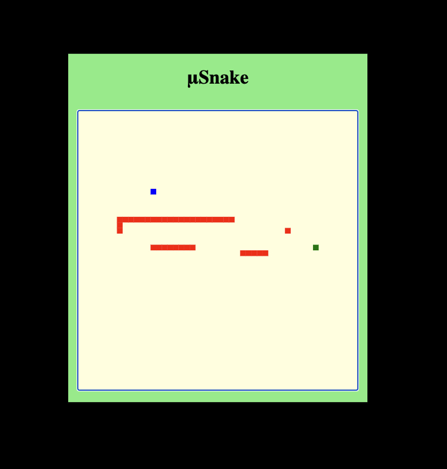

# μSnake

Not much to say besides that **this is a Multiplayer Snake game**.  Fire up the server and have fun with your friends or [**PLAY ONLINE!!**](https://musnake.herokuapp.com/)

## Setup and Development

To get an interactive development environment run:

    lein figwheel

and open your browser at [localhost:3449](http://localhost:3449/).  This will auto compile and send all changes to the browser without the need to reload. After the compilation process is complete, you will get a Browser Connected REPL. An easy way to try it is:

    (js/alert "Am I connected?")

and you should see an alert in the browser window.

To clean all compiled files:

    lein clean

To create a production build run:

    lein do clean, cljsbuild once min

And open your browser in `resources/public/index.html`. You will not get live reloading, nor a REPL.

## Development and Run

To get a standalone verison of the application run:

    lein uberjar

To execute the webserver run:

    java -jar target/musnake-standalone.jar 8080
